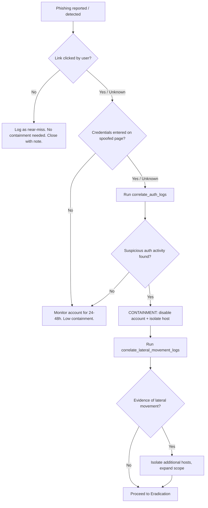

# Incident Response Playbook: Phishing → Credential Harvesting → Lateral Movement

| | |
|---|---|
| **Playbook ID** | `phishing_lateral_movement` |
| **Version** | 1.0 |
| **Machine-readable counterpart** | `config/playbooks/phishing_lateral_movement.yaml` |
| **Severity (typical)** | High |
| **Owner** | Security Operations / Incident Response |

---

## 1. Overview

This playbook covers a phishing email that leads a user to a spoofed login
page (credential harvesting), followed by the attacker using the harvested
credentials to authenticate and move laterally within the environment. It
assumes the initial detection comes from a user report, an email security
gateway alert, or anomalous authentication activity.

**Scope:** one compromised user account and one initially affected host, with
possible spread to additional hosts via valid-account lateral movement.

**Out of scope:** business email compromise (BEC) without credential
harvesting, and phishing that delivers malware directly (see a
malware-specific playbook for that variant).

---

## 2. Roles & Responsibilities

| Role | Responsibility | Typical Owner |
|---|---|---|
| Incident Commander (IC) | Owns the overall response, makes containment/eradication approval decisions, coordinates across teams | SOC Manager / senior IR analyst on call |
| Triage Analyst | First responder; performs identification steps, initial scoping | SOC Analyst (Tier 1/2) |
| IR Analyst | Executes containment/eradication actions (via this playbook's automation or manually), leads forensic collection | SOC Analyst (Tier 2/3) |
| Identity/IAM Owner | Approves and executes account disable/reset/MFA re-enrollment | IAM team |
| Network/Endpoint Owner | Approves and executes host isolation, firewall blocks | Network/Endpoint security team |
| Communications Lead | Handles internal stakeholder updates and, if needed, coordinates with Legal/Compliance | IC or designated comms owner |
| Legal/Compliance Liaison | Assesses regulatory notification obligations if the affected account had access to regulated data | Legal/Compliance |

**RACI note:** the IC is Accountable for every phase; the Triage/IR Analyst
roles are Responsible for execution; Identity/IAM and Network/Endpoint owners
are Consulted before their respective containment actions run and Informed
of the outcome.

---

## 3. Preparation

Activities that should already be true *before* this playbook is invoked:

- Email security gateway logs, authentication logs (IdP/AD/Azure AD), and
  EDR telemetry are centrally collected and searchable.
- A documented process exists for users to report suspected phishing
  (button in mail client, or a known reporting address).
- IAM tooling supports rapid account disable and forced credential
  reset/MFA re-enrollment.
- EDR or equivalent tooling supports host network isolation.
- This automation framework is configured for the current environment
  (`config/config.<env>.yaml`) and has been dry-run tested.
- On-call rotation and escalation paths for IC, IAM, and Network/Endpoint
  owners are current.

---

## 4. Identification / Detection

### 4.1 Common detection sources
- User-reported suspicious email
- Email security gateway (spam/phishing filter) alert
- Anomalous authentication: impossible travel, new device, login from an
  unexpected ASN/geo shortly after the phishing email was delivered
- EDR alert for credential-harvesting page visit (if URL reputation is
  integrated with the web proxy/EDR)

### 4.2 Initial triage checklist
1. Identify the sender domain and any malicious link domain from the
   reported email.
2. Identify the affected user and affected host (the device the link was
   clicked from, if known).
3. Run the automated identification steps (`enrich_sender_domain`,
   `enrich_malicious_link_domain`, `whois_sender_domain`,
   `correlate_auth_logs`) — see Section 9 for the automation cross-reference.
4. Determine whether authentication activity around the click time looks
   suspicious (new location/device, activity outside business hours,
   immediately followed by unusual resource access).

### 4.3 Decision tree



---

## 5. Containment

**Principle:** short-term containment first (stop the bleeding), then assess
scope before longer-term containment/eradication.

| Step | Action | Approval required? | Risk |
|---|---|---|---|
| Disable compromised account | Prevents further use of harvested credentials | Yes (Identity/IAM owner or IC) | High |
| Isolate affected host | Stops the host from being used as a pivot point | Yes (Network/Endpoint owner or IC) | High |
| Isolate additional (lateral-movement) hosts | Contains spread if correlation shows other hosts were accessed | Yes | High |
| Block malicious domain(s) | Prevents further callbacks/credential submission from other potential victims | Yes | Medium |

**Decision criteria for account disable:** any of — confirmed credential
entry on the spoofed page, suspicious authentication activity correlated to
the click window, or user self-report of entering credentials.

**Decision criteria for host isolation:** the host where the link was
clicked, always, once account compromise is suspected or confirmed; any
additional host only if lateral-movement correlation shows access from the
compromised account.

---

## 6. Eradication

- Collect forensic artifacts from the affected host (Section 9,
  `collect_forensics_affected_host`) before any rebuild or credential reset,
  to preserve evidence.
- Confirm no persistence mechanism was installed (scheduled tasks, new
  local admin accounts, mailbox rules forwarding mail externally — check
  mailbox rules specifically, as attackers with harvested credentials
  commonly add covert forwarding rules).
- Remove any malicious mailbox rules or OAuth app grants created during the
  compromise window.
- Force a credential reset and MFA re-enrollment for the affected account.

---

## 7. Recovery

- Re-enable the account only after credential reset + MFA re-enrollment is
  confirmed complete.
- Re-connect isolated hosts only after a clean EDR scan and confirmation
  that no persistence mechanism remains.
- Monitor the affected account and host for **14 days** post-recovery for
  any recurrence of suspicious authentication or lateral-movement patterns.
- Confirm with the user that they understand what happened and know how to
  recognize/report phishing going forward.

---

## 8. Lessons Learned

Hold a post-incident review within 5 business days of closure. Cover:

- **Timeline reconstruction:** time of email delivery → click → credential
  entry → first suspicious authentication → detection → containment. Identify
  the largest gaps.
- **Detection gaps:** could this have been caught earlier (gateway rule,
  proxy block, faster user reporting)?
- **Containment speed:** how long from confirmed compromise to account
  disable / host isolation? Compare against target SLA.
- **What worked / what didn't** in this automation playbook specifically —
  file a ticket against `docs/extending.md` if a new action or connector
  would have helped.
- **Metrics to record:** time-to-detect, time-to-contain, number of hosts/
  accounts affected, whether lateral movement occurred.

---

## 9. Communication Plan

| Trigger | Audience | Owner | Timing |
|---|---|---|---|
| Incident confirmed | IC, IR team | Triage Analyst | Immediately |
| Containment actions about to run | Identity/IAM owner, Network/Endpoint owner | IC | Before approval is requested |
| Confirmed lateral movement / scope expansion | IC, affected business unit leadership | IC | Within 1 hour of confirmation |
| Regulated data potentially exposed | Legal/Compliance | IC | As soon as suspected — do not wait for full confirmation |
| Incident closed | All stakeholders engaged above | IC | At closure |

Exact notification *deadlines* for regulators/customers are governed by
applicable law/contract and organizational policy — this playbook flags
**when** to loop in Legal/Compliance, not what they must do next.

---

## 10. Evidence Handling

- Preserve the original phishing email (headers included) — export as
  `.eml`, do not forward-and-reply in a way that alters headers.
- Any forensic artifacts collected (Section 6) should be hashed
  (SHA-256) immediately upon collection and stored under the configured
  `paths.evidence_dir`, named `<incident_id>/<hostname>/<artifact>`.
- Maintain a simple chain-of-custody log: who collected, when, from what
  system, and the artifact's hash — the automation's audit trail
  (`logs/audit.jsonl`) captures the automated collection step, but any
  manual collection must be logged separately using the same fields.
- Do not modify or delete anything on the affected host until forensic
  collection is complete, unless actively containing an ongoing, worsening
  compromise.

---

## 11. MITRE ATT&CK Mapping

| Tactic | Technique | Technique Name |
|---|---|---|
| Initial Access | T1566.002 | Phishing: Spearphishing Link |
| Credential Access | T1078 | Valid Accounts |
| Discovery | T1087 | Account Discovery |
| Lateral Movement | T1021 | Remote Services |
| Command and Control | T1071.001 | Application Layer Protocol: Web Protocols |

---

## 12. Automation Cross-Reference

Step `id` values below match `config/playbooks/phishing_lateral_movement.yaml`
exactly, so an analyst reading this document can see precisely what the
engine automates versus what remains manual.

| Step id | Phase | What it does | Auto-approved? |
|---|---|---|---|
| `enrich_sender_domain` | Identification | IP/domain reputation lookup on the phishing sender domain | Yes (low risk) |
| `enrich_malicious_link_domain` | Identification | IP/domain reputation lookup on the credential-harvesting landing page | Yes (low risk) |
| `whois_sender_domain` | Identification | WHOIS/DNS lookup on the sender domain | Yes (low risk) |
| `correlate_auth_logs` | Identification | Correlates authentication logs for the affected user | Yes (low risk) |
| `correlate_lateral_movement_logs` | Identification | Correlates auth/remote-access logs across other hosts (only if prior step flagged suspicious) | Yes (low risk) |
| `disable_compromised_account` | Containment | Disables the affected user's account | **No — human approval required** |
| `isolate_affected_host` | Containment | Network-isolates the affected host | **No — human approval required** |
| `isolate_lateral_movement_hosts` | Containment | Network-isolates additional hosts (conditional) | **No — human approval required** |
| `block_malicious_domain` | Containment | Blocks the malicious domain at the perimeter | **No — human approval required** |
| `collect_forensics_affected_host` | Eradication | Collects basic forensic artifacts | **No — human approval required** |
| *(Recovery, Lessons Learned)* | Recovery / Lessons Learned | Fully manual — see Sections 7–8 | N/A |

Run against this playbook, in dry-run:

```bash
ir-soar run --playbook phishing_lateral_movement --dry-run --incident-file incident.json
```
