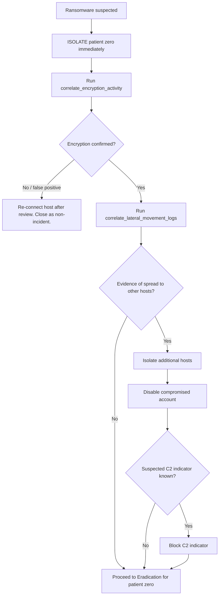

# Incident Response Playbook: Ransomware (Initial Access → Encryption → Lateral Movement)

| | |
|---|---|
| **Playbook ID** | `ransomware` |
| **Version** | 1.0 |
| **Machine-readable counterpart** | `config/playbooks/ransomware.yaml` |
| **Severity (typical)** | Critical |
| **Owner** | Security Operations / Incident Response |

---

## 1. Overview

This playbook covers a ransomware incident: an initial-access foothold
(commonly phishing, an exposed remote-access service, or a vulnerable
public-facing application) leads to file encryption on one or more hosts,
with a real risk of lateral spread before full containment. Speed matters
more here than in most other incident types — every minute of delay can mean
additional encrypted hosts.

**Scope:** one or more hosts showing active or completed encryption, with
possible further spread via lateral movement (commonly RDP, SMB, or reused
local admin credentials).

**Out of scope:** double-extortion data-exfiltration handling beyond initial
identification (that requires a dedicated data-breach response track run in
parallel — flag to Legal/Compliance immediately per Section 9).

---

## 2. Roles & Responsibilities

| Role | Responsibility | Typical Owner |
|---|---|---|
| Incident Commander (IC) | Owns the overall response; this is a Critical-severity incident by default — IC should be paged immediately | SOC Manager / IR Lead |
| Triage Analyst | Confirms scope of encryption, identifies patient zero | SOC Analyst (Tier 1/2) |
| IR Analyst | Executes containment/eradication, leads forensic collection | SOC Analyst (Tier 2/3) |
| Identity/IAM Owner | Approves/executes account disable for compromised credentials | IAM team |
| Network/Endpoint Owner | Approves/executes host isolation — this is often the single most time-critical action in this playbook | Network/Endpoint security team |
| Backup/Recovery Owner | Confirms backup integrity and availability for Recovery phase | Infrastructure/Backup team |
| Communications Lead | Coordinates internal executive updates; ransomware incidents typically require executive visibility | IC or designated comms owner |
| Legal/Compliance Liaison | Assesses regulatory notification, ransom-payment policy questions, law enforcement contact | Legal/Compliance |

---

## 3. Preparation

- Backups are tested regularly for restorability, and at least one backup
  copy is offline/immutable (not reachable from the production network with
  standard domain credentials).
- EDR/endpoint tooling supports rapid, reliable network isolation at scale
  (this playbook may need to isolate multiple hosts quickly).
- A documented ransom-payment decision policy exists and is known to the IC
  and Legal (this playbook does not make that decision — it only flags when
  to escalate to the people who do).
- Network segmentation limits blast radius from a single compromised host
  (reduces how much lateral movement is even possible).
- This automation framework is configured for the current environment and
  dry-run tested, with `max_actions_per_run` and timeouts tuned
  appropriately for the number of hosts in scope.

---

## 4. Identification / Detection

### 4.1 Common detection sources
- EDR alert for mass file modification / known ransomware behavior pattern
- User reports of inaccessible files or ransom note
- Backup software alerts (sudden spike in changed-file volume)
- SIEM correlation on process behavior consistent with encryption

### 4.2 Initial triage checklist
1. Identify "patient zero" — the first host observed encrypting files.
2. Identify the affected user account associated with that activity.
3. Collect any observed indicators: suspected C2 IP/domain, suspected
   ransomware binary hash (if isolated safely).
4. Run automated identification steps (`enrich_c2_ip`,
   `hash_reputation_ransom_binary`, `correlate_encryption_activity`) — see
   Section 9.
5. **Do not wait for full identification to begin isolating patient zero** —
   for ransomware specifically, isolate first, ask questions second.

### 4.3 Decision tree



---

## 5. Containment

**Principle:** for ransomware, isolation of patient zero happens as fast as
possible — before full scoping, not after. Everything else follows.

| Step | Action | Approval required? | Risk |
|---|---|---|---|
| Isolate patient zero | Stops further local encryption and removes it as a pivot point | Yes (but treat as urgent — expedite approval) | High |
| Isolate additional (lateral-movement) hosts | Contains spread once correlation shows other hosts were touched | Yes | High |
| Disable compromised account | Prevents further use of credentials seen initiating spread | Yes | High |
| Block C2 indicator | Cuts off command-and-control communication | Yes | Medium |

**Decision criteria for expanding isolation:** any host appearing in
`correlate_lateral_movement_logs` results as having been accessed by the
compromised account or process during the incident window.

---

## 6. Eradication

- Collect forensic artifacts from patient zero (and any other affected
  hosts) before rebuild — process listings, file/timestamp metadata, any
  ransom note text/format (useful for family identification).
- Identify the ransomware family if possible (hash reputation, ransom note
  format, file extension pattern) — this affects whether decryption tools
  exist and informs the payment-policy discussion with Legal/IC.
- Remove any persistence mechanisms and confirm the initial-access vector
  is closed (patch the exploited service, rotate the compromised credential,
  close the exposed RDP port — whatever applies).
- Do **not** rebuild from an image or backup known to predate eradication
  confirmation — verify the backup point is clean.

---

## 7. Recovery

- Restore affected hosts from the most recent **verified-clean** backup.
- Validate restored data integrity before reconnecting hosts to the
  network.
- Reconnect hosts in stages (not all at once), monitoring closely after
  each stage for recurrence.
- Reset credentials for every account observed or suspected to be involved,
  not only the initially identified one.
- Monitor for **30 days** post-recovery — ransomware operators frequently
  maintain a secondary foothold and re-attempt encryption after initial
  eradication.

---

## 8. Lessons Learned

Hold a post-incident review within 5 business days of closure (sooner for
Critical-severity incidents if executive reporting requires it). Cover:

- **Timeline reconstruction:** initial access → first encryption →
  detection → isolation of patient zero → full containment → eradication →
  recovery. The isolation-of-patient-zero step's speed is the single
  highest-leverage metric to track over time.
- **Initial access vector:** was it closed permanently, not just for this
  incident?
- **Backup effectiveness:** did a clean, restorable backup actually exist?
  If not, this is the highest-priority finding.
- **Blast radius:** how many hosts were ultimately affected, and did
  network segmentation limit or fail to limit spread?
- **Metrics to record:** time-to-isolate patient zero, total hosts
  affected, recovery time objective (RTO) actually achieved vs. target,
  whether a ransom was considered/paid.

---

## 9. Communication Plan

| Trigger | Audience | Owner | Timing |
|---|---|---|---|
| Ransomware suspected/confirmed | IC, executive leadership | Triage Analyst → IC | Immediately — this is Critical severity by default |
| Isolation actions about to run | Network/Endpoint owner | IC | Before approval is requested — expedite, do not delay for a full meeting |
| Confirmed multi-host spread | IC, executive leadership, Legal | IC | Within 30 minutes of confirmation |
| Ransom note / payment demand present | Legal/Compliance, executive leadership, potentially law enforcement | IC | Immediately upon discovery |
| Regulated data potentially exfiltrated | Legal/Compliance | IC | As soon as suspected |
| Incident closed | All stakeholders engaged above | IC | At closure |

---

## 10. Evidence Handling

- Do not power off encrypting hosts if memory forensics may be needed —
  network-isolate instead (pull the network connection / apply EDR
  isolation), leaving the host running, unless organizational policy or an
  active, worsening situation dictates otherwise.
- Preserve a copy of the ransom note (file and, if applicable, any
  onion-service URL or contact address it references) — do not visit any
  referenced URL from a corporate or identifiable network.
- Hash (SHA-256) any collected binary/artifact immediately, store under the
  configured `paths.evidence_dir`, named `<incident_id>/<hostname>/<artifact>`.
- Maintain chain-of-custody exactly as described in the phishing playbook's
  Section 10 — same standard applies here.

---

## 11. MITRE ATT&CK Mapping

| Tactic | Technique | Technique Name |
|---|---|---|
| Initial Access | T1190 | Exploit Public-Facing Application |
| Execution | T1059 | Command and Scripting Interpreter |
| Defense Evasion | T1562.001 | Impair Defenses: Disable or Modify Tools |
| Discovery | T1135 | Network Share Discovery |
| Lateral Movement | T1021.001 | Remote Services: Remote Desktop Protocol |
| Impact | T1486 | Data Encrypted for Impact |

---

## 12. Automation Cross-Reference

Step `id` values below match `config/playbooks/ransomware.yaml` exactly.

| Step id | Phase | What it does | Auto-approved? |
|---|---|---|---|
| `enrich_c2_ip` | Identification | IP/domain reputation lookup on a suspected C2 indicator | Yes (low risk) |
| `hash_reputation_ransom_binary` | Identification | Hash reputation lookup on the suspected ransomware binary | Yes (low risk) |
| `correlate_encryption_activity` | Identification | Correlates logs for mass file-modification activity | Yes (low risk) |
| `correlate_lateral_movement_logs` | Identification | Correlates SMB/RDP/remote-service logs across the environment (conditional) | Yes (low risk) |
| `isolate_patient_zero` | Containment | Network-isolates the first encrypting host | **No — human approval required** |
| `isolate_lateral_movement_hosts` | Containment | Network-isolates additional hosts (conditional) | **No — human approval required** |
| `disable_compromised_account` | Containment | Disables the account involved in spread | **No — human approval required** |
| `block_c2_indicator` | Containment | Blocks the suspected C2 IP/domain at the perimeter | **No — human approval required** |
| `collect_forensics_patient_zero` | Eradication | Collects basic forensic artifacts | **No — human approval required** |
| *(Recovery, Lessons Learned)* | Recovery / Lessons Learned | Fully manual — see Sections 7–8 | N/A |

Run against this playbook, in dry-run:

```bash
ir-soar run --playbook ransomware --dry-run --incident-file incident.json
```
